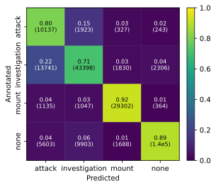

Basic usage
===========

The *vassi* package provides functions and classes for a complete behavioral classification pipeline. In the following example, we break down a minimal example of running the entire pipeline on the *CALMS21* dataset. You can find the full notebook on one of the next pages.

First, we load the *CALMS21* training dataset:

.. code-block:: python

    from vassi.config import cfg
    from vassi.io import load_dataset

    # set configuration keys (see convert_calms21_dataset.py for details)
    cfg.key_keypoints = "keypoints"
    cfg.key_timestamp = "timestamps"
    cfg.trajectory_keys = ("keypoints", "timestamps")

    dataset_train = load_dataset(
        "mice_train",
        directory="../../datasets/CALMS21/train",  # set directory
        target="dyad",
        background_category="none",
    )

    # remove all dyads in which the intruder mouse is "actor"
    dataset_train = dataset_train.exclude_individuals(["intruder"])

.. hint::
    In the *vassi* package, the first individual in a dyad is called "actor", and the second individual is called "recipient". A group usually consists of all pairwise combinations (dyads) of individuals.

Then, we can create a feature extractor to sample the dataset.

.. note::
    Feature extraction can be cached by specifying the :code:`cache_mode` argument to either :code:`True` or :code:`'cached'`. For the latter, feature extraction requires already cached feature files. You need to specify :code:`cache_directory` in both cases.
    Caching can help you to avoid recalculation of features for the same individuals or dyads and is aware of the feature extractor configuration.

.. code-block:: python

    from vassi.features import DataFrameFeatureExtractor

    extractor = DataFrameFeatureExtractor(cache_mode=False)
    extractor.read_yaml("features-mice.yaml")

With this extractor, we can compute the defined features for all dyads in the training dataset. For this quick example, we subsample the dataset so that each behavioral category is represented with 1000 samples each. This produces a :class:`~pandas.DataFrame` for the features, and a :class:`~numpy.ndarray` containing corresponding labels.

.. note::
    Have a look at the documentation for more details on subsampling. Here, we use the default arguments for stratified subsampling that ensures that each dyad (and each behavioral interval) is proportionally represented in the resulting samples. You can fix the random state to ensure reproducibility.

.. code-block:: python

    X, y = dataset_train.subsample(
        extractor,
        size={category: 1000 for category in dataset_train.categories},
        random_state=1,
    )
    y = dataset_train.encode(y)  # Encode the labels to integers

Now, we can train a model on the subsampled dataset. For this basic example, we choose a :class:`~sklearn.ensemble.RandomForestClassifier` from the :mod:`~sklearn` :mod:`~sklearn.ensemble` module.

.. code-block:: python

    from sklearn.ensemble import RandomForestClassifier

    classifier = RandomForestClassifier(random_state=1)
    classifier.fit(X, y)

Until now, the example only used the training dataset. Let's load the test dataset for evaluation and use the fitted classifier to predict on all dyads.

.. code-block:: python

    from vassi.classification.predict import predict

    dataset_test = load_dataset(
        "mice_test",
        directory="../../datasets/CALMS21/test",  # set directory
        target="dyad",
        background_category="none",
    )
    dataset_test = dataset_test.exclude_individuals(["intruder"])

    result_test = predict(dataset_test, classifier, extractor)

The resulting object :code:`result_test` (a :class:`~vassi.classification.results.DatasetClassificationResult`) holds the true and predicted labels for each dyad, for all timestamps (video frames), but also aggregated as intervals for :code:`predictions` and :code:`annotations` (both as properties that return a :class:`~pandas.DataFrame`).

Since we predicted on the entire test dataset, the result is a nested object that contains predictions for each group (video sequences of the *CALMS21* dataset, see :class:`~vassi.classification.results.GroupClassificationResult`) and each dyad (only one dyad per group: :code:`('resident', 'intruder')`, see :class:`~vassi.classification.results.ClassificationResult`).

These result objects provide easy access to evaluation metrics (inherited from :class:`~vassi.classification.results.BaseResult`), such as :meth:`~vassi.classification.results.BaseResult.f1_score` and confusion matrices. We can also visualize predictions as behavioral timelines.

.. code-block:: python

    from vassi.classification.visualization import (
        plot_confusion_matrix,
        plot_classification_timeline,
    )

    plot_confusion_matrix(
        result_test.y_true_numeric,
        result_test.y_pred_numeric,
        category_labels=result_test.categories,
    )

    result_group = result_test.classification_results[10]
    result_dyad = result_group.classification_results[("resident", "intruder")]

    plot_classification_timeline(
        result_dyad.predictions,
        annotations=result_dyad.annotations,
        categories=result_dyad.categories,
        y_proba=result_dyad.y_proba,
        timestamps=result_dyad.timestamps,
    )

Although we only trained a simple model on a subset of 4000 samples, the model already seems to classify the majority of the frames correctly.
You can fit any classification model that implements the :mod:`~sklearn` predictor `API <https://scikit-learn.org/stable/developers/develop.html#estimators>`_ to improve classification results, for example also :mod:`~xgboost` classifiers. The *vassi* package further provides two postprocessing steps to improve classification results, output *smoothing* and *thresholding*. Have a look at the example notebooks to reproduce the results as presented in the paper.
